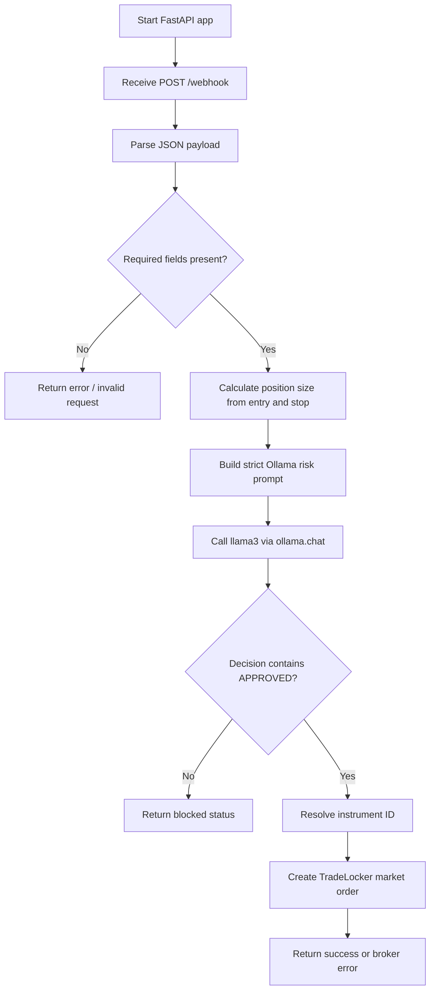
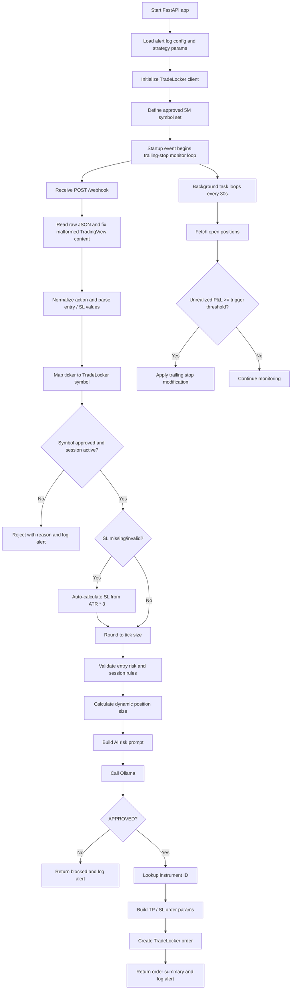
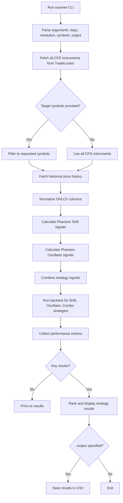
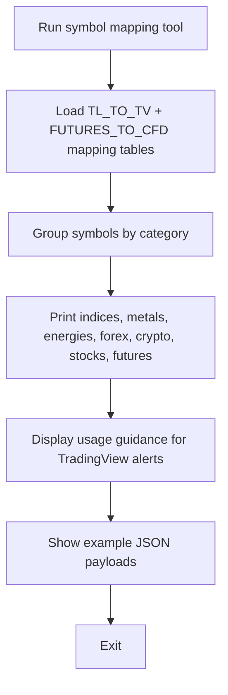
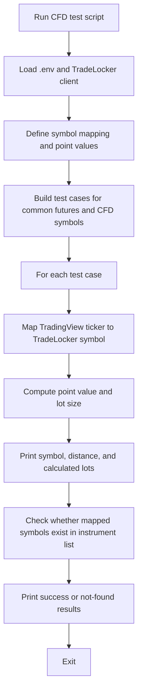
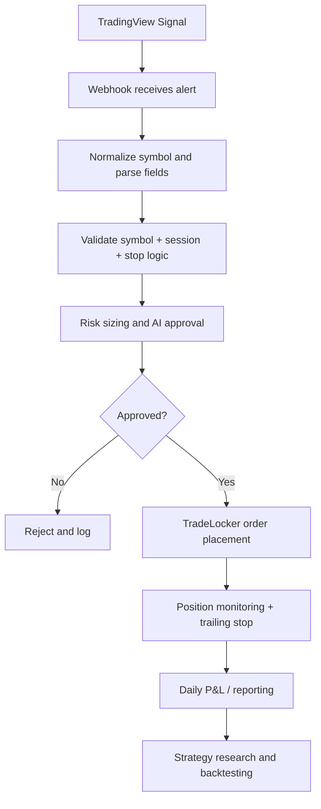

# Script Flowcharts

This document summarizes the runtime flow of each script in the project, using Mermaid flowcharts based on the actual logic in the code.

---

## [scripts/main.py](scripts/main.py)



---

## [scripts/main_cfd.py](scripts/main_cfd.py)

```mermaid
flowchart TD
    A[Start FastAPI app] --> B[Read broker credentials from .env]
    B --> C[Initialize TradeLocker client]
    C --> D[Receive POST /webhook]
    D --> E[Parse action, ticker, entry, SL, trend]
    E --> F[Map TradingView symbol to TradeLocker CFD symbol]
    F --> G[Calculate risk-based lot size]
    G --> H[Build AI validation prompt]
    H --> I[Call Ollama]
    I --> J{APPROVED?}
    J -- No --> K[Return blocked]
    J -- Yes --> L[Lookup instrument by mapped symbol]
    L --> M[Create broker order]
    M --> N[Return success / broker response]

    D --> O[GET /instruments]
    O --> P[List available instruments]
    D --> Q[GET /symbols/{asset_class}]
    Q --> R[Filter instruments by asset class]
```

---

## [scripts/main_cfd_5m.py](scripts/main_cfd_5m.py)



---

## [scripts/daily_pnl.py](scripts/daily_pnl.py)

```mermaid
flowchart TD
    A[Run script or CLI command] --> B{--week flag set?}
    B -- Yes --> C[Call get_weekly_summary()]
    B -- No --> D[Call get_daily_pnl(target_date)]

    D --> E[Resolve Eastern Time target date]
    E --> F[Fetch all executions from TradeLocker]
    F --> G[Filter executions by target day]
    G --> H{Any trades found?}
    H -- No --> I[Print no trades and exit]
    H -- Yes --> J[Group executions by positionId]
    J --> K[Determine entry, exit, side, and P&L]
    K --> L[Resolve symbol name from instrument ID]
    L --> M[Build trade summary rows]
    M --> N[Calculate closed trades summary]
    N --> O[Print daily P&L report]
    O --> P[Check loss limit threshold]
    P --> Q[Save CSV file]
    Q --> R[Return DataFrame]

    C --> S[Loop through recent trading days]
    S --> T[Call get_daily_pnl() for each day]
    T --> U[Aggregate daily P&L into weekly summary]
    U --> V[Print weekly summary table]
```

---

## [scripts/phantom_scanner.py](scripts/phantom_scanner.py)



---

## [scripts/swing_analysis.py](scripts/swing_analysis.py)

```mermaid
flowchart TD
    A[Run swing analysis] --> B[Load TradeLocker credentials]
    B --> C[Initialize TradeLocker client]
    C --> D[Loop symbols in TOP_SYMBOLS]
    D --> E[Lookup instrument ID]
    E --> F[Fetch 5-minute price history]
    F --> G{Enough data?}
    G -- No --> H[Skip symbol]
    G -- Yes --> I[Convert to DataFrame and set time index]
    I --> J[Find swing highs and lows]
    J --> K[Compute bullish and bearish move metrics]
    K --> L[Compute percentile targets (P50-P90)]
    L --> M[Store per-symbol results]
    M --> N[Print summary table]
    N --> O[Print recommended TP levels]
    O --> P[Print detailed per-symbol stats]
```

---

## [scripts/tv_symbols.py](scripts/tv_symbols.py)



---

## [scripts/test_cfd.py](scripts/test_cfd.py)



---

## Overall project flow



This flow reflects the main trading loop in the repo: signal ingestion, validation, execution, monitoring, and analysis.
