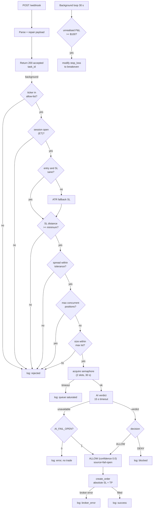

# DigitalOcean Migration Plan — Option B

## Lightweight $6 Droplet + Cloud AI API

Single self-contained document: architecture, cost, every code and infrastructure change, the
ordered migration procedure with verification gates, operations runbook, rollback, and
troubleshooting.

**Scope:** migrate `scripts/main_cfd_5m.py` from a 4 GB droplet running Ollama on CPU to a 1 GB
droplet with the AI risk review delegated to a cloud API.
**Target runtime:** DigitalOcean droplet, Ubuntu 24.04, Cloudflare named tunnel ingress,
TradeLocker broker, DeepSeek/Groq/OpenRouter for AI.
**Status:** **Option B is LIVE on 138.197.8.50 as of 2026-09-28.**
Tunnel `trader-agent` (0656b758-bf72-4f79-838c-18a977c3d8df) serves
`https://webhook.cello1505.com`. AI layer is DeepSeek (`deepseek-chat`, fail-closed).
The old server 143.198.7.200 still runs the Quick Tunnel and is untouched; TradingView has NOT
been repointed yet. Terraform manages both droplets (the old one read-only).
Both droplets are running concurrently at $30/mo combined until cutover.

**Status history:** this plan was written before implementation. What shipped:

| Phase | Outcome |
|---|---|
| Code (§6) | `scripts/ai_decider.py` added; `main_cfd_5m.py` hardened; `requirements.txt` swaps `ollama` for `httpx` |
| Infra (§7) | `variables.tf`, `main.tf`, `outputs.tf`, `user_data.sh` rewritten for Option B |
| Procedure (§8) | Executed out of order — provisioning happened before the Phase 0 baseline week, so the ALLOW/DENY ratio comparison was skipped |
| Ops (§9) | `monitor_health.py` extended with memory, OOM and AI-state checks |

Deviations from the plan, both forced by reality:
- The apex `cello1505.com` already had A records, so the tunnel uses the `webhook.` subdomain.
- The droplet is Ubuntu 22.04 (Python 3.10) and `tradelocker==0.56.0` requires >=3.11, so Python
  3.12 was installed from deadsnakes. `user_data.sh` does not do this yet.

See [`SERVERS.md`](SERVERS.md) for the live deployment state.

## Table of contents

1. [Why Option B](#1-why-option-b)
2. [Target architecture](#2-target-architecture)
3. [Network and data flow](#3-network-and-data-flow)
   - [3.1 Network topology](#31-network-topology) · [3.2 Network flow](#32-network-flow-one-alert-end-to-end) · [3.3 Data flow](#33-data-flow-what-crosses-each-hop) · [3.4 Sequence diagram](#34-sequence-diagram) · [3.5 Decision flow](#35-decision-flow) · [3.6 Failure-domain map](#36-failure-domain-map) · [3.7 Not in the flow](#37-what-is-not-in-the-new-flow)
4. [Cost](#4-cost)
5. [Audit of the current system](#5-audit-of-the-current-system)
6. [Code changes](#6-code-changes)
7. [Infrastructure changes](#7-infrastructure-changes)
8. [Migration procedure](#8-migration-procedure)
9. [Operations runbook](#9-operations-runbook)
10. [Rollback](#10-rollback)
11. [Risk register](#11-risk-register)
12. [Troubleshooting](#12-troubleshooting)

---

## 1. Why Option B

Your original concern was that a 4 GB RAM footprint does not fit cheaply on DigitalOcean. That is
correct, and Option B removes the footprint instead of paying for it.

The decisive observation is about what the AI step actually does. The prompt at
`scripts/main_cfd_5m.py:1017-1019` asks the model for a three-field JSON classification:

```json
{"decision": "ALLOW" | "DENY", "confidence": 0.0-1.0, "reason": "brief"}
```

That is not a long generation. It is a classification over a ~350-token structured payload that is
already almost fully determined by the technical summary and the risk rules. Model quality above a
small threshold buys almost nothing here, and the output is capped at roughly 40 tokens.

Against that, running Ollama on 2-4 shared vCPUs costs you:

- $18-42/month of droplet RAM you are not otherwise using;
- 3-15 seconds of inference per signal, during which a thread is pinned and the queue backs up;
- ~2.3 GB of resident weights on a box that also runs the kernel, Python, pandas, tradelocker and
  the tunnel, leaving no headroom for KV-cache peak or a second model.

At 10-50 webhooks/day, a cloud AI API costs well under $1/month. The trade is not close.

**What Option B does not change:** the deterministic risk layer. Entry validation, SL distance,
spread, session windows, ATR fallback SL, position sizing, TP calculation, breakeven SL and the
overdue-position closer at `scripts/main_cfd_5m.py:683-828` all still run on the droplet, exactly
as today. The cloud model is one input among several, and the deterministic gates run before it
(`scripts/main_cfd_5m.py:903-1014`). Moving the AI off the box does not weaken those gates.

---

## 2. Target architecture

```
┌──────────────────────────────────────────────────────────────────┐
│  TradingView                                                      │
│  alert fires → POST /webhook      (3 second response budget)     │
└───────────────────────────────┬──────────────────────────────────┘
                                │ HTTPS
                                ▼
┌──────────────────────────────────────────────────────────────────┐
│  Cloudflare named tunnel        webhook.yourdomain.com            │
│  (ingress restricted to this hostname; port 8000 not exposed)    │
└───────────────────────────────┬──────────────────────────────────┘
                                ▼
┌──────────────────────────────────────────────────────────────────┐
│  DigitalOcean droplet  s-1vcpu-1gb  ·  $6/mo                     │
│  Ubuntu 24.04 · 1 GB RAM · 25 GB SSD · 4 GB swap                 │
│                                                                  │
│  Uvicorn  scripts.main_cfd_5m:app   --workers 1   (~450 MB RSS)   │
│    │                                                             │
│    ├─ POST /webhook                                               │
│    │     └─ 200 {"status":"accepted","task_id":...}   < 200 ms   │
│    │           └─ asyncio.to_thread(  semaphore(2)  )             │
│    │                                                              │
│    ├─ deterministic gates  (symbol, spread, SL, sessions, size)   │
│    ├─ AI reviewer  ────HTTPS────►  DeepSeek / Groq / OpenRouter  │
│    ├─ TradeLocker client ──────►  broker                         │
│    ├─ breakeven SL + overdue closer   (background loop, 30s)     │
│    └─ /health · /status · /trailing-status · /symbols             │
│                                                                  │
│  No Ollama. No model weights. No GPU. No model pull at boot.      │
└──────────────────────────────────────────────────────────────────┘
```

Removed versus today: the Ollama install, the model pull, `ollama.service`, and the
`Requires=ollama.service` dependency. Added: the cloud AI call, a `/health` endpoint, memory
monitoring, and an explicit fail-open/fail-closed policy.

---

## 3. Network and data flow

### 3.1 Network topology

Every connection the new architecture makes. Nothing else crosses the droplet's interfaces.

```
                        INTERNET
                           │
        ┌──────────────────┼───────────────────┐
        │                  │                   │
        │ inbound 443      │ outbound 443      │ outbound 53
        ▼                  ▼                   ▼
┌───────────────┐   ┌──────────────┐   ┌──────────────┐
│  TradingView  │   │  AI provider │   │ DNS resolver │
│  alert webhook│   │ (DeepSeek/   │   │  (A/AAAA for │
└───────┬───────┘   │  Groq/etc.)  │   │   TradeLocker│
        │           └──────┬───────┘   │   + DO API)   │
        │ HTTPS/443        │ HTTPS/443  └──────┬───────┘
        │                  │                  │ HTTPS/443
        ▼                  │                  ▼
┌───────────────────┐      │         ┌──────────────────┐
│ Cloudflare edge   │      │         │  TradeLocker API │
│  anycast PoPs     │      │         │  demo or live    │
└─────────┬─────────┘      │         └──────────────────┘
          │ QUIC/HTTP2     │                ▲
          │ outbound 7844  │                │ HTTPS/443 (droplet -> broker,
          │                │                │  separate from tunnel leg)
          │        ┌───────┴────────────────┴──────────────────────────┐
          └───────►│  DIGITALOCEAN DROPLET  s-1vcpu-1gb  ($6/mo)      │
                   │  ──────────────────────────────────────────────  │
                   │  eth0  ── IPv4 (reserved IP, traffic via tunnel)  │
                   │  lo    ── 127.0.0.1:8000  uvicorn  (NO EXPOSURE)  │
                   │  ──────────────────────────────────────────────  │
                   │  cloudflared ─┐                                    │
                   │  uvicorn ─────┴─ main_cfd_5m:app                   │
                   │  monitor_health.py (cron)                         │
                   │  sshd :22  (from var.ssh_ip only)                 │
                   └──────────────────────────────────────────────────┘
```

Key properties of this topology:

- **The droplet has no public listening port except SSH.** Port 8000 binds to `127.0.0.1`
  only. All internet traffic arrives through the Cloudflare edge over an outbound-initiated
  connection, so there is nothing to scan and nothing to DDoS directly.
- **Only three egress destinations.** The AI provider, TradeLocker, and DNS. Everything else is
  denied, so a compromised process has a very small surface to exfiltrate to.
- **Two independent outbound TLS paths.** The tunnel leg (port 7844) and the TradeLocker leg
  (port 443) are separate connections from separate processes. A Cloudflare outage does not stop
  order execution; a TradeLocker outage does not stop the tunnel.
- **The AI provider is the only new third party in the decision path.**

### 3.2 Network flow: one alert, end to end

Numbered in execution order. The two shaded steps are the ones with deadlines.

```
 1  TradingView                POST https://webhook.yourdomain.com/webhook
                              deadline: must be answered within 3 s
─────────────────────────────────────────────────────────────────
 2  Cloudflare edge           TLS terminate, match hostname to tunnel
 3  cloudflared               multiplex over the existing tunnel leg,
                              forward to http://127.0.0.1:8000/webhook
 4  uvicorn middleware        decompress gzip (main_cfd_5m.py:35-77),
                              repair unquoted {{placeholder}} JSON
 5  FastAPI /webhook          parse JSON, mint task_id, spawn
                              asyncio.to_thread task, return immediately
                              deadline: < 200 ms
                              returns 200 {"status":"accepted","task_id":"…"}
─────────────────────────────────────────────────────────────────
 6  worker thread             deterministic gates, in order:
                              symbol allow-list
                              session window (ET)
                              entry/SL sanity
                              SL distance minimum
                              ATR fallback SL
                              live spread
                              max concurrent positions
                              position size vs max lot
 7  AI review                 acquire semaphore (2 slots, 30 s wait)
                              POST to provider  ── deadline: 15 s ──
 8  verdict parse             strict ALLOW|DENY, else fail policy
 9  order placement           POST TradeLocker /orders
10  mutate SL                 POST TradeLocker /positions/{id} when
                              unrealised P&L >= $100 (breakeven)
11  log_alert                 append to alerts_log.jsonl
```

Steps 6 through 11 are all outside the 3-second budget. Step 5 is the only one that matters for
TradingView's success signal, and it touches no broker and no AI call.

### 3.3 Data flow: what crosses each hop

The payload changes shape at every boundary. This is where mistakes hide, so each hop is spelled
out.

#### Hop 1 — TradingView → Cloudflare → droplet

Inbound, `POST /webhook`, public internet, TLS 1.3 terminated at the Cloudflare edge.

```json
{
  "action": "buy",
  "ticker": "XPDUSD.R",
  "indicator_value": 2665.42,
  "suggested_sl": 2661.80,
  "trend": "Phantom Combo Buy",
  "alert_name": "Phantom Flow XPDUSD 5m"
}
```

Notes that matter:

- TradingView sends **gzipped** bodies on some alert configurations. The middleware at
  `scripts/main_cfd_5m.py:35-77` decompresses and strips the `content-encoding` header.
- TradingView emits **unquoted `{{ticker}}` placeholders** when a webhook field is not
  interpolated. The same middleware quotes them, and `process_tradingview_alert` additionally
  guesses a missing `action` from the alert name or trend string
  (`scripts/main_cfd_5m.py:860-875`). The fallback defaults to `buy` when it cannot tell — worth
  knowing before you trust an unlabelled alert.
- Anything not parseable as float falls back to `0.0`
  (`scripts/main_cfd_5m.py:882-890`), which then fails the SL sanity check downstream. Fail-loud
  by rejection, not by execution.
- **No authentication.** Anyone who knows the URL can POST. The only mitigations are the
  unguessable hostname, Cloudflare Access, or a shared secret in the payload. See §12.

#### Hop 2 — droplet → AI provider

Outbound, `POST {CLOUD_API_URL}`, HTTPS 443, bearer-token auth, ~15 s timeout.

```json
{
  "model": "deepseek-chat",
  "temperature": 0,
  "max_tokens": 96,
  "messages": [{
    "role": "user",
    "content": "{\"symbol\":\"XPDUSD.R\",…,\"rules\":\"max 3 concurrent, $400 daily loss, 1.5x R:R\"}\nEvaluate this trade…\n\nReply with ONLY valid JSON…"
  }]
}
```

Response:

```json
{ "choices": [{ "message": { "content": "{\"decision\":\"ALLOW\",\"confidence\":0.82,\"reason\":\"trend and RSI aligned, spread within tolerance\"}" } }] }
```

Data-flow properties:

- **`temperature: 0`.** Makes the verdict as close to deterministic as the provider allows, which
  is what you want for a risk gate and what makes the Phase 2 comparison meaningful.
- **The prompt is the entire risk context and it is small**: symbol, side, entry, SL, SL distance,
  quantity, dollar risk, trend, technical summary, sessions, and the hard rules. Roughly 350
  tokens. Nothing market-sensitive beyond the alert itself is sent, so the disclosure surface to a
  third party is your current position intent. Consider that a commercial trade, not free.
- **The API key is the only secret in the hop**, held in `.env` (mode 600) and in Terraform state.
- **Nothing comes back except the verdict.** The response is parsed for a bounded
  `ALLOW`/`DENY`; any other shape is treated as unavailable and routed to the fail policy.

#### Hop 3 — droplet → TradeLocker

Outbound, HTTPS 443, session-token auth from `TL_USER`/`TL_PASS` on first call.

Three distinct request classes flow here, not one:

| Call | When | Purpose |
|---|---|---|
| Auth / session | cold start, on token expiry | `TL_USER` + `TL_PASS` → session token |
| Read | every alert, and the 30 s monitor loop | live price, spread, positions, instrument id |
| Write | only on `ALLOW`, and on breakeven trigger | create order, modify stop loss |

The read calls are the ones that produce 429s. They are already throttled by a 120 s position
cache (commit `c9efd94`); do not lower it. The write call at
`scripts/main_cfd_5m.py:1141` carries the parameters that matter:

```json
{
  "instrument_id": 12345,
  "quantity": 0.42,
  "side": "buy",
  "type_": "market",
  "stop_loss": 2661.80,
  "stop_loss_type": "absolute",
  "take_profit": 2669.70,
  "take_profit_type": "absolute"
}
```

Data-flow properties:

- **The verdict never leaves the droplet.** `agent_notes` is written to
  `alerts_log.jsonl`, not to the broker. TradeLocker sees a normal order.
- **SL and TP are absolute prices computed on the droplet** from the live price fetched at step 6,
  not offsets the broker resolves. That makes the live-price fetch load-bearing: a stale or wrong
  price produces a wrong absolute stop.
- **Breakeven is a separate write**, issued by the background loop at
  `scripts/main_cfd_5m.py:683-720` when unrealised P&L crosses `$100`, with an overshoot
  allowance so the modification is not rejected for being the wrong side of current price.
- **The broker is authoritative for state.** The droplet keeps no positions database; every read
  is a fresh call modulo the cache. This means a droplet loss loses no position state, only
  in-flight work and the decision log.

#### Hop 4 — droplet → disk

`alerts_log.jsonl`, one JSON object per line, append-only:

```json
{"timestamp":"2026-09-25T14:22:07.881Z",
 "alert":{"action":"buy","ticker":"XPDUSD.R","indicator_value":2665.42,…},
 "result":{"status":"success","tv_ticker":"XPDUSD.R","tl_symbol":"XPDUSD",
           "executed_quantity":0.42,"risk_dollars":100,
           "agent_notes":"ALLOW (confidence: 0.82, source=cloud): trend and RSI aligned…",
           "technical_summary":"…","broker_response":"…","tp_levels":"TP1: $150 (abs 2669.70)"}}
```

This file is the audit trail: it records what was asked, what was decided, and what was sent. It
lives only on the droplet and is destroyed by `terraform destroy`. It is also the input to the
Phase 0 and Phase 2 comparisons, which is why archiving it is step 2 of the migration rather than
an afterthought.

### 3.4 Sequence diagram

```mermaid
sequenceDiagram
    autonumber
    participant TV as TradingView
    participant CF as Cloudflare edge
    participant CFRL as cloudflared
    participant API as FastAPI /webhook
    participant W as Worker thread
    participant AI as AI provider
    participant TL as TradeLocker

    TV->>CF: POST /webhook (JSON, maybe gzipped)
    CF->>CFRL: tunnel leg (QUIC, 7844)
    CFRL->>API: HTTP 127.0.0.1:8000
    API->>API: gunzip + repair placeholders
    API-->>CF: 200 {"status":"accepted","task_id"}
    CF-->>TV: 200 OK  (well under 3 s)
    API--)W: asyncio.to_thread

    W->>W: gates: symbol, session, SL, ATR, spread, count, size
    W->>AI: acquire semaphore (2 slots)
    AI-->>W: {"decision":"ALLOW","confidence":0.82,…}
    W-->>W: strict parse; else fail policy

    alt decision == ALLOW
        W->>TL: create_order (qty, side, absolute SL + TP)
        TL-->>W: order id / fill
        W->>W: log_alert → alerts_log.jsonl
        loop every 30 s while position open
            W->>TL: get_positions
            TL-->>W: positions
            W->>TL: modify stop_loss → breakeven at +$100
        end
    else decision == DENY
        W->>W: log_alert (blocked)
    else provider unavailable
        W->>W: log_alert (error) + fail policy
    end
```

### 3.5 Decision flow



Every terminal node writes exactly one line to `alerts_log.jsonl`. `X1` through `X5` are the
outcomes that are silently invisible unless you read the log or query `/health` — which is why the
`ai.decisions` and `ai.failures` counters in §6.4 exist.

### 3.6 Failure-domain map

What breaks what. This is the operational payoff of moving the AI off the box.

| Failure | Effect on trading | Detected by | Recovery |
|---|---|---|---|
| Cloudflare edge down | No alerts arrive | `cloudflared` reconnect logs, no `alerts_log` growth | Automatic |
| Tunnel down | No alerts arrive | `systemctl status cloudflared` | Automatic restart |
| FastAPI process dead | No alerts processed, no breakeven management | `monitor_health.py` service check | systemd `Restart=always`, ~10 s |
| AI provider down | No trades (`AI_FAIL_OPEN=0`) or unguarded trades (`=1`) | `ai.failures` in `/health` | Automatic on provider recovery |
| AI rate-limited | Same as provider down | `ai.last_error` | Automatic, backoff on retries |
| TradeLocker down | No orders, no breakeven management; decisions still logged | `broker_error` in the log | Automatic |
| TradeLocker 429s | Slow reads, possible stale live price | Latency, 120 s cache | Reduce polling, do not lower the cache TTL |
| Droplet OOM | Process dies, open positions unmanaged until restart | `ai` unreachable, kernel OOM line | systemd restart; **breakeven management is down meanwhile** |
| Model denies everything | No trades, system looks healthy | `ai.last_decision` + `last_decision_at` | Phase 2 ratio gate catches this pre-migration |

The last two rows are the ones that matter most, and they are the two you have no alert for today.
That is the substance of §6.4 and §9's monitoring additions.

### 3.7 What is *not* in the new flow

Worth stating explicitly, since these are the things people expect to find:

- **No Ollama, no model weights, no model pull at boot.** Nothing downloads 2 GB on a 25 GB disk.
- **No inbound connection from the AI provider.** The droplet dials out; the provider cannot reach
  in, so there is no callback URL to secure.
- **No port 8000 in the firewall.** `cloudflared` proxies to loopback.
- **No synchronisation protocol to operate.** The 4 GB box had an unhealthy-alert interaction to
  tune; a stateless HTTP call does not.
- **No state to reconcile.** The droplet holds no position state to rebuild after a restart.

---

## 4. Cost

| Item | Option B | Today (4 GB + Ollama) |
|---|---|---|
| Droplet `s-1vcpu-1gb` | $6.00 | — |
| Droplet `s-2vcpu-4gb` | — | $24.00 |
| Cloud AI tokens (est.) | < $1.00 | $0.00 |
| Reserved IP (optional) | $4.00 | $0.00 |
| Backups (optional, 20%) | $1.20 | $4.80 |
| **Total** | **$6.00 - $11.20** | **$24.00 - $28.80** |

**Savings: ~$18/month**, or ~$30/month with a reserved IP and backups on both.

Token estimate: 10-50 webhooks/day × 350 input + 40 output tokens ≈ 20k tokens/day ≈ 600k tokens/
month. At DeepSeek-class pricing (~$0.28/M input, ~$0.42/M output) that is roughly $0.15/month.
Even at 10× your current alert volume it stays under $2.

Cost ceiling guardrail: set a hard spend limit on the AI provider account. An accidental prompt
loop on a metered endpoint is the one failure mode in this architecture that can cost real money,
and a provider-side budget cap is the only thing that stops it.

---

## 5. Audit of the current system

Several of the risks in the original brief are already solved in the repo. Do not regress them.

### Already correct

| Concern | Status | Evidence |
|---|---|---|
| Webhook must return 200 before any AI work | **Done** | `scripts/main_cfd_5m.py:831-839` — `asyncio.create_task(asyncio.to_thread(...))` then returns `{"status":"accepted","task_id":...}` |
| Background task failures must surface | **Done** | `scripts/main_cfd_5m.py:841-846` — `report_background_task_failure` logs the traceback |
| Swap file for memory bursts | **Done** | `terraform/digitalocean/user_data.sh:5-10` — 8 GB `/swapfile` created first thing |
| Service runs unprivileged | **Done** | `terraform/digitalocean/user_data.sh:56-82` — `User=trader`, `MemoryMax=3G`, `CPUQuota=200%` |
| Small model rather than a large one | **Done** | `terraform/digitalocean/terraform.tfvars:12` — `phi3:mini` (~2.3 GB Q4) |
| Broker polling throttled | **Done** | Position cache TTL raised to 120s (commit `c9efd94`) to avoid 429s |

**The 3-second timeout risk is already mitigated.** That was the single highest-severity item in the
brief and it is handled. Phase 1 adds a regression test for it, not a fix.

### Gaps that must be closed for Option B

| # | Gap | Impact | Severity |
|---|---|---|---|
| G1 | `OLLAMA_KEEP_ALIVE` is never set; default is 300s idle unload, so a signal after 5 idle minutes pays a 5-10s+ cold start reading weights from disk | Stale-signal window on Option A. **Moot on Option B** — the model is always warm upstream | Low (B) |
| G2 | `ollama.chat()` at `scripts/main_cfd_5m.py:1022-1025` has no timeout and no option caps; the Python client enforces no read deadline by default | A slow generation pins a thread indefinitely; concurrent alerts stack up unbounded. **Applies equally to the cloud call** | **High** |
| G3 | No concurrency cap on AI evaluation; every accepted alert spawns an unconstrained `to_thread` task | Alert bursts cause thread pileup. Worse on a 1 GB box with 6 executor threads | **High** |
| G4 | AI failure is fail-closed but unlabelled: `scripts/main_cfd_5m.py:1028-1031` returns `{"status":"error"}` and the trade is silently dropped, no counter, no alert | A dead AI provider is indistinguishable from a normal rejection in the log stream. **Now a remote dependency, so more likely** | **High** |
| G5 | `/status` (`scripts/main_cfd_5m.py:1179-1191`) reports config only — no AI reachability, no queue depth, no memory. `scripts/monitor_health.py` checks only that the service is active and `/status` returns 200 | A cloud-provider outage is invisible until you notice zero trades | **High** |
| G6 | `Requires=ollama.service` and `After=network.target ollama.service` at `terraform/digitalocean/user_data.sh:59-60` | Blocks Option B entirely; the receiver must not depend on a local AI daemon | **High** |
| G7 | Sizing default `s-2vcpu-4gb` at `terraform/digitalocean/variables.tf:40-48` | Must become `s-1vcpu-1gb` | Medium |
| G8 | Duplicate TP/sizing block at `scripts/main_cfd_5m.py:1177-1205` — the entire position-size, point-value and TP1 calculation runs a second time | Wasted price/point-value calls, doubled log noise, real divergence risk if the copies drift. It is the only change in this plan that touches order parameters | Medium |
| G9 | Quick Tunnel at `terraform/digitalocean/user_data.sh:85-100` (`cloudflared tunnel --url ...`) contradicts the named-tunnel procedure in `CLOUDFLARE_TUNNEL_SETUP.md` | Public URL changes on every restart, breaking the TradingView alert config | Medium |
| G10 | `scripts/monitor_health.py:41-52` scrapes journal output for a `trycloudflare.com` URL | Detector never fires once G9 is fixed | Low |
| G11 | 1 GB RAM is the tightest box this service will run on. No memory ceiling on the process, no memory alerting | 1 GB is one spike away from an OOM kill mid-session | **High** |

---

## 6. Code changes

### 6.1 New file: `scripts/ai_decider.py`

One interface, two backends. The backend is selected by whether `CLOUD_API_URL` is set, so the
existing Ollama path stays available as a fallback and you can flip providers by editing `.env`
and restarting — no code change, no redeploy.

```python
#!/usr/bin/env python3
"""
AI risk reviewer for trader-agent.

Returns a structured ALLOW/DENY verdict. Backend is selected by environment:

  CLOUD_API_URL set   -> OpenAI-compatible chat completions (DeepSeek, Groq, OpenRouter, ...)
  CLOUD_API_URL unset -> local Ollama

Every call is bounded by AI_TIMEOUT_SECONDS. Every response is parsed defensively.
"""

import json
import os
import re
import time

OLLAMA_BASE_URL = os.getenv("OLLAMA_BASE_URL", "http://127.0.0.1:11434")
CLOUD_API_URL = os.getenv("CLOUD_API_URL", "")
CLOUD_API_KEY = os.getenv("CLOUD_API_KEY", "")
CLOUD_API_MODEL = os.getenv("CLOUD_API_MODEL", "deepseek-chat")
AI_MODEL = os.getenv("AI_MODEL", "phi3:mini")

AI_TIMEOUT_SECONDS = float(os.getenv("AI_TIMEOUT_SECONDS", "15"))
AI_MAX_PREDICT = int(os.getenv("AI_MAX_PREDICT", "96"))

_JSON_INSTRUCTION = (
    'Reply with ONLY valid JSON, no prose and no code fence: '
    '{"decision":"ALLOW"|"DENY","confidence":0.0-1.0,"reason":"brief"}. '
    "decision must be exactly ALLOW or DENY."
)


class AiUnavailable(Exception):
    """Raised when the provider cannot be reached or returns an unusable response."""


def backend() -> str:
    return "cloud" if CLOUD_API_URL else "ollama"


def decide(prompt: str) -> dict:
    """
    Return {"decision","confidence","reason","latency_ms","source"}.

    Raises AiUnavailable on transport error, timeout, or unparseable response.
    Callers decide the fail policy; this module never guesses.
    """
    started = time.monotonic()
    try:
        raw = _call_cloud(prompt) if CLOUD_API_URL else _call_ollama(prompt)
    except AiUnavailable:
        raise
    except Exception as exc:
        raise AiUnavailable(f"{type(exc).__name__}: {exc}") from exc

    result = _parse(raw)
    if result is None:
        raise AiUnavailable("response contained no parseable decision object")
    result["latency_ms"] = int((time.monotonic() - started) * 1000)
    result["source"] = backend()
    return result


def _call_ollama(prompt: str) -> str:
    import httpx

    with httpx.Client(timeout=AI_TIMEOUT_SECONDS) as client:
        resp = client.post(
            f"{OLLAMA_BASE_URL}/api/chat",
            json={
                "model": AI_MODEL,
                "messages": [{"role": "user", "content": f"{prompt}\n\n{_JSON_INSTRUCTION}"}],
                "stream": False,
                "keep_alive": -1,
                "options": {
                    "temperature": 0,
                    "num_predict": AI_MAX_PREDICT,
                    "num_ctx": 2048,
                },
            },
        )
    resp.raise_for_status()
    return resp.json()["message"]["content"]


def _call_cloud(prompt: str) -> str:
    import httpx

    with httpx.Client(timeout=AI_TIMEOUT_SECONDS) as client:
        resp = client.post(
            CLOUD_API_URL,
            headers={"Authorization": f"Bearer {CLOUD_API_KEY}"},
            json={
                "model": CLOUD_API_MODEL,
                "messages": [{"role": "user", "content": f"{prompt}\n\n{_JSON_INSTRUCTION}"}],
                "temperature": 0,
                "max_tokens": AI_MAX_PREDICT,
            },
        )
    resp.raise_for_status()
    return resp.json()["choices"][0]["message"]["content"]


def _parse(text: str):
    """Extract the first JSON object carrying a 'decision' key. None if absent."""
    for candidate in re.findall(r"\{[^{}]*\}", (text or "").strip(), re.DOTALL):
        try:
            # Repair leading-zero numbers the small models emit, e.g. 00.4
            fixed = re.sub(r":\s*0+(\d)", lambda m: f": {m.group(1)}", candidate)
            parsed = json.loads(fixed)
        except (json.JSONDecodeError, ValueError):
            continue
        if "decision" in parsed:
            decision = str(parsed.get("decision", "")).upper()
            if decision not in ("ALLOW", "DENY"):
                continue
            try:
                confidence = float(parsed.get("confidence", 0.0))
            except (TypeError, ValueError):
                confidence = 0.0
            return {
                "decision": decision,
                "confidence": max(0.0, min(1.0, confidence)),
                "reason": str(parsed.get("reason", "no reason provided"))[:280],
            }
    return None
```

Two behaviour changes versus the current parser at `scripts/main_cfd_5m.py:1037-1058`, both
intentional:

- An unparseable response now raises instead of silently defaulting to `DENY`. A silent DENY is
  indistinguishable from a genuine risk rejection. The caller applies the configured fail policy
  and the failure is counted and logged.
- A confidence value that is present but non-numeric is coerced to `0.0` and clamped, rather than
  raising inside the JSON handling.

### 6.2 `scripts/main_cfd_5m.py` — module level

Add next to the other configuration constants, near `scripts/main_cfd_5m.py:28-32`:

```python
import sys
import threading

sys.path.insert(0, os.path.dirname(os.path.abspath(__file__)))
import ai_decider

# Bound concurrent AI evaluations. The default asyncio thread executor allows
# cpu_count + 4 workers; without this cap an alert burst pins every thread on a
# provider call and the 1 GB box runs out of memory.
AI_MAX_CONCURRENCY = int(os.getenv("AI_MAX_CONCURRENCY", "2"))
AI_QUEUE_TIMEOUT_SECONDS = float(os.getenv("AI_QUEUE_TIMEOUT_SECONDS", "30"))
AI_FAIL_OPEN = os.getenv("AI_FAIL_OPEN", "0") == "1"

_AI_GATE = threading.Semaphore(AI_MAX_CONCURRENCY)

_AI_STATE = {
    "decisions": 0,
    "failures": 0,
    "last_error": None,
    "last_latency_ms": None,
    "last_decision": None,
    "last_source": None,
    "last_decision_at": None,
}


def _ai_reset_stats() -> None:
    """Called at startup so counters reflect this process, not the last one."""
    _AI_STATE.update({
        "decisions": 0, "failures": 0, "last_error": None,
        "last_latency_ms": None, "last_decision": None,
        "last_source": None, "last_decision_at": None,
    })
```

Cap of 2: a 1 GB box has ~1 GB usable after the kernel and tunnel, and the Python process already
sits around 450 MB. Two in-flight HTTP calls with a ~350-token payload are small, but each also
holds a response buffer and a thread stack. Beyond 2 the queue delay exceeds the timeout and you
are paying for throughput you cannot use.

### 6.3 `scripts/main_cfd_5m.py` — the AI decision block

Replace `scripts/main_cfd_5m.py:1016-1060` (the prompt construction, the `ollama.chat` call, the
`except` branch, and the inline JSON parsing) with:

```python
    # AI Risk Check — structured JSON verdict, bounded by timeout and concurrency
    prompt = f"""{{"symbol":"{tv_ticker}","tl_symbol":"{tl_symbol}","action":"{action}},"entry":{live_price},"sl":{suggested_sl},"sl_dist":{abs(live_price - suggested_sl):.2f},"qty":{prelim_qty},"risk":{TARGET_DOLLAR_RISK},"trend":"{trend_context}","tech":"{tech_summary}","sessions":{TOP_SYMBOLS[tl_symbol]['sessions']},"rules":"max 3 concurrent, $400 daily loss, 1.5x R:R"}}
Evaluate this trade for a 5M scalping prop challenge. Check for trend/technical direction conflicts. Decision must be ALLOW or DENY.
"""

    if not _AI_GATE.acquire(timeout=AI_QUEUE_TIMEOUT_SECONDS):
        _AI_STATE["failures"] += 1
        _AI_STATE["last_error"] = "ai queue saturated"
        result = {
            "status": "error",
            "reason": "ai evaluation queue saturated",
            "fail_open": AI_FAIL_OPEN,
        }
        log_alert(data, result)
        print("[AI] queue saturated; trade dropped", flush=True)
        return result

    try:
        verdict = ai_decider.decide(prompt)
    except ai_decider.AiUnavailable as exc:
        _AI_STATE["failures"] += 1
        _AI_STATE["last_error"] = f"{type(exc).__name__}: {exc}"
        result = {
            "status": "error",
            "reason": f"ai provider unavailable: {exc}",
            "fail_open": AI_FAIL_OPEN,
        }
        log_alert(data, result)
        print(f"[AI] provider error ({ai_backend_label()}): {exc}", flush=True)
        if not AI_FAIL_OPEN:
            return result
        decision, confidence, reason = "ALLOW", 0.0, f"ai unavailable, fail-open: {exc}"
        source = "fail-open"
    else:
        decision = verdict["decision"]
        confidence = verdict["confidence"]
        reason = verdict["reason"]
        source = verdict["source"]
        _AI_STATE["decisions"] += 1
        _AI_STATE["last_latency_ms"] = verdict["latency_ms"]
        _AI_STATE["last_decision"] = decision
        _AI_STATE["last_source"] = source
        _AI_STATE["last_decision_at"] = datetime.utcnow().isoformat() + "Z"
        print(
            f"[AI] {source} decision={decision} confidence={confidence:.2f} "
            f"latency={verdict['latency_ms']}ms reason={reason}",
            flush=True,
        )
    finally:
        _AI_GATE.release()

    agent_notes = f"{decision} (confidence: {confidence:.2f}, source={source}): {reason}"
    print(f"[AI PARSED] {agent_notes}", flush=True)
```

Add this small helper next to the other module-level helpers so the log line above has a subject:

```python
def ai_backend_label() -> str:
    """Human-readable AI backend name for log lines."""
    try:
        return ai_decider.backend()
    except Exception:
        return "unknown"
```

**Fail-open policy — decide this before Phase 2, do not leave it to an exception handler.**

`AI_FAIL_OPEN=0` (the default) is fail-closed and is correct for a prop challenge: if the reviewer
is unreachable, an unreviewed trade risks the account. `AI_FAIL_OPEN=1` treats a provider outage as
an approval, which converts an infrastructure failure into live market exposure.

The trade-off is now sharper than it was with a local Ollama, because the failure domain includes a
third party's availability. On balance, fail-closed remains the right default: a missed trade costs
nothing, a bad trade can breach the challenge. If you choose fail-open, confirm the value is
present in `/health` output so a silent mode change is never mistaken for a quiet trading day.

### 6.4 `scripts/main_cfd_5m.py` — health endpoint

Insert before the existing `/status` handler at `scripts/main_cfd_5m.py:1179`:

```python
@app.get("/health")
async def health():
    """
    Liveness plus AI-backend state. Must stay fast and must never call the
    AI provider on the request path — monitoring polls this every 5 minutes.
    """
    backend = ai_backend_label()
    payload = {
        "ok": True,
        "service": "trader-agent",
        "ts": datetime.utcnow().isoformat() + "Z",
        "ai": {
            "backend": backend,
            "model": (ai_decider.CLOUD_API_MODEL if backend == "cloud" else ai_decider.AI_MODEL),
            "key_configured": bool(ai_decider.CLOUD_API_KEY) if backend == "cloud" else None,
            "fail_open": AI_FAIL_OPEN,
            "max_concurrency": AI_MAX_CONCURRENCY,
            "decisions": _AI_STATE["decisions"],
            "failures": _AI_STATE["failures"],
            "last_error": _AI_STATE["last_error"],
            "last_latency_ms": _AI_STATE["last_latency_ms"],
            "last_decision": _AI_STATE["last_decision"],
            "last_decision_at": _AI_STATE["last_decision_at"],
        },
    }
    if backend == "ollama":
        try:
            import httpx

            with httpx.Client(timeout=2.0) as client:
                resp = client.get(f"{ai_decider.OLLAMA_BASE_URL}/api/tags")
            payload["ai"]["reachable"] = resp.status_code == 200
            payload["ai"]["models_loaded"] = [m["name"] for m in resp.json().get("models", [])]
        except Exception as exc:
            payload["ai"]["reachable"] = False
            payload["ai"]["last_error"] = f"{type(exc).__name__}: {exc}"
    return payload
```

`/status` keeps its existing config-only contract so the monitor and any dashboard keep working
unchanged. `/health` is the new operational surface.

### 6.5 `scripts/main_cfd_5m.py` — startup reset

Add `_ai_reset_stats()` as the first statement of the existing startup handler at
`scripts/main_cfd_5m.py:792-795`, so counters restart with the process.

### 6.6 `scripts/main_cfd_5m.py` — remove the duplicate TP block (G8)

Delete `scripts/main_cfd_5m.py:1177-1205`. That range repeats the position size, point value and
TP1 calculation already performed at lines 1144-1175, including a second `[TP DEBUG]` line.

**The two blocks are not byte-for-byte identical.** The first has a `quantity is None` guard that
returns early; the second does not:

```
$ diff <(sed -n '1144,1175p' scripts/main_cfd_5m.py) <(sed -n '1177,1205p' scripts/main_cfd_5m.py)
<             if quantity is None:
<                 result = {"status": "rejected", "reason": f"Position size exceeds max_lot for {tl_symbol}"}
<                 log_alert(data, result)
<                 return result
```

This was verified before deleting, and the deletion is still safe: the second block recomputes
from identical inputs (`tv_ticker`, `live_price`, `suggested_sl`), so it produced the same
`quantity` and the same `tp1_price` that `order_params` then used. Removing it leaves the values
unchanged. The missing guard is harmless only because the first block already returned on `None`.

Verify the emitted order parameters are unchanged by comparing the `tp_levels` and
`executed_quantity` fields for the same signal in `alerts_log.jsonl` before and after. This is the
only edit in the plan that touches what gets sent to the broker, so it runs as its own commit and
its own rollback point.

---

## 7. Infrastructure changes

### 7.1 `terraform/digitalocean/variables.tf` — sizing and new inputs

```hcl
variable "droplet_size" {
  description = "Droplet size slug. Option B uses s-1vcpu-1gb (no local Ollama)."
  type        = string
  default     = "s-1vcpu-1gb"
  validation {
    condition     = contains(["s-1vcpu-1gb", "s-1vcpu-2gb", "s-2vcpu-2gb", "s-2vcpu-4gb", "s-4vcpu-8gb"], var.droplet_size)
    error_message = "Invalid size. Choose from: s-1vcpu-1gb, s-1vcpu-2gb, s-2vcpu-2gb, s-2vcpu-4gb, s-4vcpu-8gb"
  }
}

variable "ai_provider" {
  description = "cloud = OpenAI-compatible API, ollama = local model. Option B sets cloud."
  type        = string
  default     = "cloud"
  validation {
    condition     = contains(["cloud", "ollama"], var.ai_provider)
    error_message = "ai_provider must be cloud or ollama"
  }
}

variable "ai_fail_open" {
  description = "1 = execute trades when the AI backend is unavailable, 0 = deny. 0 is safer for prop accounts."
  type        = string
  default     = "0"
}

variable "cloud_api_model" {
  description = "Model name for the OpenAI-compatible provider"
  type        = string
  default     = "deepseek-chat"
}
```

Add `cloud_api_url` and `cloud_api_key` as `sensitive` string variables with no defaults, so the
endpoint and key come from `terraform.tfvars` and land only in the droplet `.env` and in
Terraform state (which is gitignored).

### 7.2 `terraform/digitalocean/main.tf` — template variables

Extend the `templatefile` call at `terraform/digitalocean/main.tf:21-29`:

```hcl
  user_data          = templatefile("${path.module}/user_data.sh", {
    tradelocker_email    = var.tradelocker_email
    tradelocker_password = var.tradelocker_password
    tradelocker_server   = var.tradelocker_server
    ollama_model         = var.ollama_model
    ai_provider          = var.ai_provider
    ai_fail_open         = var.ai_fail_open
    cloud_api_url        = var.cloud_api_url
    cloud_api_key        = var.cloud_api_key
    cloud_api_model      = var.cloud_api_model
    risk_per_trade       = var.risk_per_trade
    daily_loss_limit     = var.daily_loss_limit
    max_concurrent_positions = var.max_concurrent_positions
  })
```

Do not add a `reserved_ip` resource in the same apply as the migration. See Phase 3.

### 7.3 `terraform/digitalocean/user_data.sh` — remove Ollama, add AI config

**a. Swap size.** Line 5 becomes 4 GB — a 1 GB box needs it, and the 8 GB file is dead weight on a
25 GB disk.

```bash
fallocate -l 4G /swapfile 2>/dev/null
chmod 600 /swapfile 2>/dev/null
mkswap /swapfile 2>/dev/null
swapon /swapfile 2>/dev/null
echo '/swapfile none swap sw 0 0' >> /etc/fstab 2>/dev/null
```

**b. Delete the Ollama install block** (currently lines 21-26), the `ollama pull` at line 108, and
the `sleep 15` at line 107. Nothing in the Option B runtime touches Ollama, and the pull alone
would push a 25 GB disk to its limit.

**c. `.env` gains the AI configuration.** Replace the heredoc at lines 45-50:

```bash
cat > /opt/trader-agent/.env << ENVEOF
TL_ENV=https://demo.tradelocker.com
TL_USER=${tradelocker_email}
TL_PASS=${tradelocker_password}
TL_SERVER=${tradelocker_server}
AI_PROVIDER=${ai_provider}
AI_FAIL_OPEN=${ai_fail_open}
CLOUD_API_URL=${cloud_api_url}
CLOUD_API_KEY=${cloud_api_key}
CLOUD_API_MODEL=${cloud_api_model}
AI_MODEL=${ollama_model}
AI_TIMEOUT_SECONDS=15
AI_MAX_CONCURRENCY=2
AI_QUEUE_TIMEOUT_SECONDS=30
AI_MAX_PREDICT=96
ENVEOF

chown trader:trader /opt/trader-agent/.env
chmod 600 /opt/trader-agent/.env
```

`TL_ENV` is hardcoded to the demo environment in the current script. Confirm that is intended
before every apply; a rebuild that silently defaults to demo while you believe you are live is the
most expensive mistake available in this plan.

**d. Systemd unit — drop the Ollama dependency (G6).** Replace lines 56-82:

```ini
[Unit]
Description=Trader Agent Webhook Server
After=network-online.target
Wants=network-online.target

[Service]
Type=simple
User=trader
Group=trader
WorkingDirectory=/opt/trader-agent
Environment=PATH=/opt/trader-agent/venv/bin:/usr/local/bin:/usr/bin:/bin
EnvironmentFile=/opt/trader-agent/.env
ExecStart=/opt/trader-agent/venv/bin/uvicorn scripts.main_cfd_5m:app --host 127.0.0.1 --port 8000 --workers 1
Restart=always
RestartSec=10
StandardOutput=journal
StandardError=journal
SyslogIdentifier=trader-agent

LimitNOFILE=65536
MemoryMax=700M
CPUQuota=200%

[Install]
WantedBy=multi-user.target
```

Three changes: `Requires=ollama.service` and `After=... ollama.service` are gone because there is no
local AI daemon and the receiver must serve `/health` even while the provider is unreachable.
`MemoryMax` drops from 3G to 700M to fit a 1 GB box — systemd's `MemoryMax` is a cgroup limit, so
the process gets an OOM kill at a predictable threshold rather than the kernel taking the whole box
down. `--workers 1` is mandatory: two workers would double the resident footprint and split the
in-process AI stats and semaphores.

**e. Named tunnel instead of the Quick Tunnel (G9).** Delete the `cloudflared.service` heredoc at
lines 84-100 and replace with the named-tunnel unit, which does not rewrite its URL on restart:

```ini
[Unit]
Description=Cloudflare Tunnel
After=network-online.target
Wants=network-online.target

[Service]
Type=simple
User=root
ExecStart=/usr/local/bin/cloudflared tunnel --no-autoupdate run trader-agent
Restart=always
RestartSec=30

[Install]
WantedBy=multi-user.target
```

`/etc/cloudflared/config.yml` must exist first, per `CLOUDFLARE_TUNNEL_SETUP.md` steps 3-5. Do not
create the service in cloud-init before the tunnel exists — `systemctl enable cloudflared` will
succeed and the unit will crash-loop until you finish Phase 4.

**f. Post-start health check.** Replace lines 110-119:

```bash
systemctl start trader-agent

for i in $(seq 1 20); do
  if curl -fsS http://127.0.0.1:8000/health > /dev/null 2>&1; then
    echo "Service healthy after ${i}s"
    break
  fi
  sleep 1
done

curl -fsS http://127.0.0.1:8000/health | python3 -m json.tool || echo "WARNING: /health did not respond"
```

A hard `curl` at a fixed sleep either passes or is silently ignored; a retry loop tells you which
happened. Keep the final `curl -m json.tool` line — it is the first thing anyone checks when a new
box misbehaves.

### 7.4 Firewall

The current firewall at `terraform/digitalocean/main.tf:91-102` opens 80 and 443 to the world, which
is only necessary for the Quick Tunnel. With a named tunnel all traffic arrives over Cloudflare's
edge and those two rules can be dropped, leaving SSH restricted to `var.ssh_ip` only. Do this in
Phase 4, after the tunnel is confirmed working — closing them early locks you out of the public
surface while you still depend on it.

### 7.5 `requirements.txt`

No change is required. `httpx` arrives as a transitive dependency of the `ollama` package, which is
already listed. Once the Ollama backend is no longer exercised, replace `ollama` with an explicit
`httpx` entry so the dependency is declared rather than inherited, and drop the local-model import
at `scripts/main_cfd_5m.py:16`.

---

## 8. Migration procedure

Six phases. Each has an explicit gate. Do not begin a phase until the previous gate passes.

### Phase 0 — Baseline, no changes

Nothing is modified. You are establishing what "normal" looks like so the migration can be proven
neutral.

1. Add a UTC timestamp to the `[AI DECISION]` print at `scripts/main_cfd_5m.py:1027` and let it run
   a full trading week. You need a latency p50/p95 and an ALLOW/DENY ratio to compare against.
2. Copy `alerts_log.jsonl` to a safe location outside the repo. It is the behavioural baseline and
   the only record of why each trade was taken or skipped.
3. Write down the current TradingView webhook URL and the current droplet IP.
4. Confirm the provider account has a spend limit set. Do this before the first paid call.

**Gate:** latency distribution recorded, decision ratio recorded, baseline log archived, spend limit
confirmed. Without these you cannot prove the migration changed behaviour, and an unnoticed shift
in the model's decisions is the one failure here that silently costs money.

### Phase 1 — Code changes, still on the 4 GB box

Land §6.1-6.5 as a single commit with `AI_PROVIDER=ollama` and no `CLOUD_API_URL`. Behaviour must
match the Phase 0 baseline exactly. This isolates the refactor from the architecture change.

```bash
systemctl restart trader-agent
sleep 3
curl -fsS http://127.0.0.1:8000/health | python3 -m json.tool
```

Expect `ok: true`, `ai.backend: "ollama"`, `ai.models_loaded` containing `phi3:mini`,
`ai.failures: 0`.

Regression test for the 3-second TradingView budget, run while the service is under load:

```bash
for i in 1 2 3 4 5; do
  curl -s -o /dev/null -w "ack: %{time_total}s\n" -X POST http://127.0.0.1:8000/webhook \
    -H 'Content-Type: application/json' \
    -d '{"action":"buy","ticker":"XPDUSD.R","indicator_value":2665,"suggested_sl":0,"trend":"Phantom Combo Buy"}'
done
```

Every acknowledgement must be under ~200 ms, including while generations are in flight.

Confirm no timeout regression by watching for 20 minutes:

```bash
journalctl -u trader-agent -f | grep -E '\[AI\]|error|Traceback'
```

**Gate:** `/health` reports the backend reachable; all five acks under 200 ms; no `AiUnavailable`
in the journal; AI decisions match the Phase 0 baseline for the same inputs.

### Phase 2 — Switch the AI provider, still on the 4 GB box

Change only the provider. Do not resize yet. This keeps a regression attributable to exactly one
change.

```bash
cat >> /opt/trader-agent/.env <<'EOF'
AI_PROVIDER=cloud
CLOUD_API_URL=https://api.deepseek.com/v1/chat/completions
CLOUD_API_KEY=sk-...
CLOUD_API_MODEL=deepseek-chat
EOF
systemctl restart trader-agent
curl -fsS http://127.0.0.1:8000/health | python3 -m json.tool
```

Expect `ai.backend: "cloud"`, `key_configured: true`.

Run one full session on the demo account. Then compare against the baseline:

```bash
python3 - <<'PY'
import json, collections
c = collections.Counter()
for line in open('/opt/trader-agent/scripts/alerts_log.jsonl'):
    try:
        r = json.loads(line)["result"]
    except Exception:
        continue
    notes = r.get("agent_notes", "")
    c["ALLOW" if "ALLOW" in notes else ("DENY" if "DENY" in notes else r.get("status", "other"))] += 1
print(c)
PY
```

**Gate:** 24 hours of demo signals with zero broker errors; AI latency p95 under 2s; the ALLOW/DENY
ratio within roughly 10 percentage points of the Phase 0 baseline. A large shift means the models
disagree materially and you must inspect individual decisions before continuing — do not wave this
through, because a model that DENYs everything looks identical to a system that is working fine and
simply never gets valid signals.

### Phase 3 — Drop the droplet to 1 GB

Attach a reserved IP first. `droplet_size` changes force a droplet replacement, which changes the
public IP and breaks the TradingView webhook URL. A reserved IP lets you re-point the record and the
tunnel instead of chasing a new hostname.

If you are on the Quick Tunnel at this point, expect to update the TradingView URL as part of this
phase regardless.

```bash
# add a DO reserved IP, attach it, confirm it responds, then:
terraform plan  -var 'droplet_size=s-1vcpu-1gb'
terraform apply -var 'droplet_size=s-1vcpu-4gb'   # rollback value
```

Verify on the new box:

```bash
free -m
journalctl -k --since -1h | grep -i 'out of memory\|oom-kill'
```

Then fire a burst of five parallel alerts and watch memory:

```bash
for i in $(seq 1 5); do
  curl -s -o /dev/null -X POST http://127.0.0.1:8000/webhook -H 'Content-Type: application/json' \
    -d '{"action":"buy","ticker":"XPDUSD.R","indicator_value":2665,"suggested_sl":0,"trend":"Phantom Combo Buy"}' &
done; wait
free -m
```

**Gate:** available memory stays above 512 MB through the burst; no OOM lines in the kernel journal;
trader-agent still active after 30 minutes; the AI still returns decisions.

### Phase 4 — Named tunnel and firewall

Follow `CLOUDFLARE_TUNNEL_SETUP.md` steps 2-5 to create the named tunnel and write
`/etc/cloudflared/config.yml`. Then install the `cloudflared.service` unit from §7.3(e), and only
then update the TradingView webhook URL.

```bash
systemctl restart cloudflared
curl -fsS https://webhook.yourdomain.com/health | python3 -m json.tool
```

Confirm the URL survives a restart — that is the whole point of the named tunnel:

```bash
systemctl restart cloudflared && sleep 5
curl -fsS https://webhook.yourdomain.com/health > /dev/null && echo "URL stable"
```

Then close ports 80 and 443 in `terraform/digitalocean/main.tf`, apply, and re-verify the tunnel
still serves. Then remove the dead `trycloudflare.com` scraper from `scripts/monitor_health.py`
(G10) — with a named tunnel it never fires, and dead detection code is worse than none because it
looks like coverage.

**Gate:** the public URL is unchanged across a `cloudflared` restart; a TradingView test alert adds
a line to `alerts_log.jsonl`; `/health` is reachable over the public hostname with 80/443 closed.

### Phase 5 — Steadying

- Enable the Phase 1 monitoring additions (§9).
- Let it run a full trading week.
- Only then destroy the 4 GB box. Keep it as a rollback target for at least one week — it costs
  $24 and it is the fastest path back if something surfaces in live data.

**Gate:** one clean week — no missed alerts, no unexplained rejections, memory stable, no OOM.

---

## 9. Operations runbook

### Health check

```bash
curl -fsS https://webhook.yourdomain.com/health | python3 -m json.tool
```

`ok: true` means the process is alive. `ai.*` tells you whether the decision path works. The
failure you cannot afford is `ok: true` with `ai.key_configured: false` or a rising
`ai.failures` — the process is healthy and the bot is not trading.

### Monitoring additions to `scripts/monitor_health.py`

Insert after the existing endpoint check at `scripts/monitor_health.py:98`:

1. **Available memory.** `free -m | awk '/Mem:/{print $7}'` against a 512 MB floor. This is the
   OOM early warning. A 1 GB box gives you no log line you will actually read before the kernel
   killer arrives.
2. **OOM history.** `journalctl -k --since -1h | grep -i 'out of memory\|oom-kill'` — catches a
   kill that already happened.
3. **AI backend state.** Poll `/health` and alert when `ai.key_configured` is false, `ai.failures`
   increased since the last run, or `ai.last_decision_at` is older than 2 hours during market
   hours. A stale `last_decision_at` is the signal that catches a silently dead reviewer.
4. **Zero-decision detection.** Alert if `ai.decisions` has not incremented in 6 hours while the
   London or New York session is open. This is the check that would have caught a model denying
   everything in Phase 2.

Every new check needs the change-guarded pattern the file already uses (see the state file at
`scripts/monitor_health.py:17` and the `save_url`/`load_last_url` pattern at lines 54-63). A 5-minute
cron that writes on every run will bury the alerts that matter.

### The 3-second budget

Re-verify after any refactor that touches the request path:

```bash
curl -s -o /dev/null -w 'ack: %{time_total}s\n' -X POST http://127.0.0.1:8000/webhook \
  -H 'Content-Type: application/json' \
  -d '{"action":"buy","ticker":"XPDUSD.R","indicator_value":2665,"suggested_sl":0,"trend":"Phantom Combo Buy"}'
```

Anything above ~200 ms means AI or broker work has leaked back onto the request path.

### Logs

```bash
journalctl -u trader-agent -f                          # service
journalctl -u trader-agent -p err --since -1h         # errors only
journalctl -k --since -1h | grep -i 'oom\|memory'    # kernel
tail -f /opt/trader-agent/scripts/alerts_log.jsonl    # decisions
```

`alerts_log.jsonl` is your audit trail and it lives only on the droplet. Sync it off the box on a
schedule and before any replacement.

### Scaling

`droplet_size` changes force a replacement. Always have a reserved IP and the named tunnel in
place first. Roll back with the previous value:

```bash
terraform apply -var 'droplet_size=s-2vcpu-4gb'
```

### Environment variables

| Variable | Default | Purpose |
|---|---|---|
| `TL_ENV` | `https://demo.tradelocker.com` | Broker environment. Verify after every rebuild. |
| `TL_USER` / `TL_PASS` / `TL_SERVER` | — | TradeLocker credentials |
| `AI_PROVIDER` | `cloud` | `cloud` or `ollama` |
| `CLOUD_API_URL` | — | OpenAI-compatible completions endpoint. Its presence selects the cloud backend. |
| `CLOUD_API_KEY` | — | Provider API key |
| `CLOUD_API_MODEL` | `deepseek-chat` | Cloud model name |
| `AI_MODEL` | `phi3:mini` | Ollama tag, used only by the ollama backend |
| `AI_TIMEOUT_SECONDS` | `15` | Hard deadline on one evaluation |
| `AI_MAX_CONCURRENCY` | `2` | Concurrent evaluations; the rest wait on the semaphore |
| `AI_QUEUE_TIMEOUT_SECONDS` | `30` | Max wait for a slot before the trade is dropped |
| `AI_MAX_PREDICT` | `96` | Output token cap |
| `AI_FAIL_OPEN` | `0` | `0` deny on provider failure, `1` execute unvalidated |

---

## 10. Rollback

Every phase reverses without a rebuild.

| Phase | Rollback | Time |
|---|---|---|
| 0 | Nothing to do | — |
| 1 (code) | `git revert <sha> && systemctl restart trader-agent` | ~1 min |
| 2 (provider) | Remove the `CLOUD_*` lines from `.env`, set `AI_PROVIDER=ollama`, restart | ~30 s |
| 3 (resize) | `terraform apply -var 'droplet_size=s-2vcpu-4gb'`; with a reserved IP the address stays and the webhook keeps working | ~10 min |
| 4 (tunnel) | Reinstall the Quick Tunnel unit; only the TradingView URL changes | ~5 min |
| 5 | Keep the old box running until the week completes | — |

Two irreversible items, both of which you control:

- **`alerts_log.jsonl` is destroyed by `terraform destroy`.** Sync it out first. It is the only
  record of what the system decided and why.
- **TradingView alert configuration is not in Terraform.** If the webhook hostname changes, you
  update it by hand in the TradingView UI. Record the current URL in Phase 0.

Terraform state and the SSH key are not on the droplet and survive a replace. Broker credentials
live in `.env` on the droplet and are regenerated from `terraform.tfvars` on the new box.

---

## 11. Risk register

| Risk | Likelihood | Impact | Mitigation |
|---|---|---|---|
| Cloud model denies everything; bot stops trading and looks healthy | **Medium** | **High** — silent loss of every signal | Phase 2 ratio gate; zero-decision alert in `monitor_health.py`; `/health` exposes `last_decision_at` |
| Provider outage during London/NY session | Low | Medium — no trades, or fail-open execution | `AI_FAIL_OPEN=0` default; provider uptime far exceeds a 1 GB droplet's |
| OOM kill on a 1 GB box under alert burst | **Medium** | **High** — dies mid-session with open positions | `MemoryMax=700M`; `AI_MAX_CONCURRENCY=2`; 4 GB swap; memory alert at 512 MB |
| Provider spend runaway from a retry loop | Low | Medium — real money, unbounded | Semaphore caps in-flight calls; single attempt per alert; provider-side spend limit set in Phase 0 |
| Draining the box and cutting the service in two | Low | Medium — minutes of downtime | Semaphore wait is 30s, timeout 15s, one attempt per alert; no retry loop anywhere |
| Prompt injection via a crafted TradingView payload | Low | Medium — model output hijack | The payload is assembled as JSON with `json.dumps` of typed fields, and the parser only accepts a bounded `ALLOW`/`DENY`; **verify the current f-string interpolation at `scripts/main_cfd_5m.py:1017` is not breakable by a quote character in `trend` or `tech`** |
| Webhook ack exceeds 3s | Low (already async) | High — TradingView marks failure | Ack path is free of AI and broker calls; asserted under 200 ms in Phases 1 and 3 |
| Resize drops the public IP and breaks the webhook | **High if done carelessly** | High | Reserved IP before any replace; named tunnel for a stable hostname |
| `TL_ENV` defaults to demo after a rebuild | Low | **Critical** | Hardcoded in `user_data.sh`; verify explicitly post-migrate |
| TradeLocker 429s during a burst | Medium | Medium | Position cache TTL is 120s (commit `c9efd94`); do not lower it |
| The duplicate TP block (G8) diverges after edit | Low | High — wrong order parameters | Diffed before deleting: the copies differ only by a `quantity is None` guard, and recompute from identical inputs, so emitted values are unchanged. Confirm via `tp_levels` in the log |

The prompt-injection row deserves a concrete check. The prompt is built by string interpolation
today, and `trend_context` and `tech_summary` are both derived from the TradingView payload. If
either can contain a double quote, a crafted alert can break out of the JSON literal in the
prompt. When you touch that block in Phase 1, build the payload with `json.dumps` on a dict rather
than an f-string. The parser is already tolerant, but a prompt that fails to parse is a wasted
call at best.

---

## 12. Troubleshooting

| Symptom | Likely cause | Fix |
|---|---|---|
| TradingView reports webhook failed | Ack exceeded 3s, or tunnel down | `curl -w '%{time_total}'` against `/webhook`; `systemctl status cloudflared` |
| No new lines in `alerts_log.jsonl` | Alerts not arriving, or rejected before `log_alert` | `curl /health`; `journalctl -u trader-agent -n 100` |
| `ai provider unavailable` on every alert | Missing or wrong API key, wrong endpoint, provider outage | `curl /health` and read `ai.last_error`; verify `CLOUD_API_URL` includes the full `/chat/completions` path |
| `/health` shows `ok: true` but no trades happen | Model denying everything, or `decisions: 0` | Check `ai.last_decision` and `last_decision_at`; run the Phase 2 ratio script |
| Every trade fails with `ai queue saturated` | `AI_MAX_CONCURRENCY` too low, or provider latency above 30s | Raise `AI_MAX_CONCURRENCY` to 3 if memory allows; investigate provider latency |
| Service dies under an alert burst | OOM | `journalctl -k \| grep -i oom`; raise to `s-1vcpu-2gb` or lower `AI_MAX_CONCURRENCY` |
| All trades `DENY` right after the provider switch | Different model, different calibration | Compare against the Phase 0 baseline; a systematic shift needs prompt review, not acceptance |
| Broker 429 errors | Position polling too frequent | Cache TTL is 120s; do not lower it. Confirm the change from `c9efd94` is present |
| Broker rejects after a rebuild | `TL_ENV` reset to demo | `grep TL_ENV /opt/trader-agent/.env` |
| `terraform apply` changes the IP | Droplet replacement from a size change | Expected without a reserved IP; attach one before resizing |
| Cloudflared unit crash-loops | Tunnel not created yet, or `config.yml` missing | `journalctl -u cloudflared -n 50`; complete `CLOUDFLARE_TUNNEL_SETUP.md` steps 3-5 |
| High swap usage on a 1 GB box | `MemoryMax=700M` too tight for pandas plus a burst | Check `MemoryHigh` usage; raise to 800M before considering a larger droplet |

### Safety

- The webhook is internet-facing. Restrict tunnel ingress to the `webhook` hostname and do not
  expose port 8000.
- **`/webhook` has no authentication.** Anyone who knows the hostname can submit a trade signal.
  The hostname is the only secret, and an unguessable subdomain is not a control. Put Cloudflare
  Access in front of it, or add a shared-secret field to the webhook JSON and reject mismatches at
  the top of `process_tradingview_alert`. This is a pre-existing gap, not one Option B introduces,
  and it is the highest-value hardening available to you.
- `.env` holds live broker credentials and the provider API key: `chmod 600`, owner `trader`,
  never in git. `terraform.tfvars` is gitignored; keep it that way.
- `AI_FAIL_OPEN=1` means a provider outage silently becomes unguarded order execution. Only enable
  it if you accept live market exposure on an infrastructure failure, and confirm it in `/health`.
- `terraform destroy` deletes the droplet and `alerts_log.jsonl` with it. Sync the log first.
